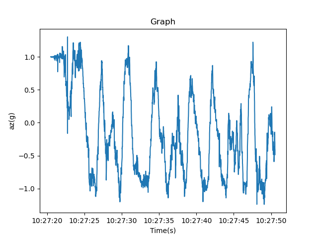

# プログラムの説明書
 加速度の測定データのうち、アドレス、時間、z軸値を30秒分トリミングし、ファイル出力するプログラムです。
## 使い方 
**1.** プログラムを実行\
**2.** トリミングする測定データ(テキストファイル)を選択\
**3.** 保存先を選択、保存ファイル名を入力\
**4.** トリミングされたcsvファイルとグラフ画像が保存される

## 入力ファイル例(.txt)
| address | Time(s) | ChipTime | ax(g) | ay(g) | az(g) | AngleX(deg) | ... | hz |
| ------- | ------- | -------- | ----- | ----- | ----- | ----------- | --- | -- |
|  0x50 | 10:27:20.526 | 2021-02-10 13:11:17.670 | -0.0127 | -0.0093 | 1.0005 | -0.3406 | ... | -170 |
|  0x50 | 10:27:20.526 | 2021-02-10 13:11:17.680 | -0.0127 | -0.0093 | 1.0005 | -0.3406 | ... | -171 |
|  0x50 | 10:27:20.526 | 2021-02-10 13:11:17.680 | -0.0107 | -0.0054 | 1.0000 | -0.3406 | ... | -172 |
| ... |... | ... | ... | ... | ... | ... | ... | ... |
|  0x50 | 10:28:22.498 | 2021-02-10 13:12:20.085 | -0.8755 | 0.3638 | 0.1646 | 58.2495 | ... | 59 |

## 出力ファイル例(.csv)
| address | Time(s) | az(g) |
| ------- | ------- | ----- |
|  0x50 | 10:27:20.526 | 1.0005 |
|  0x50 | 10:27:20.526 | 1.0005 |
|  0x50 | 10:27:20.526 | 1.0000 |
| ... |... | ... |
|  0x50 | 10:27:50.522 | -0.4858 |

## グラフ画像例
 
